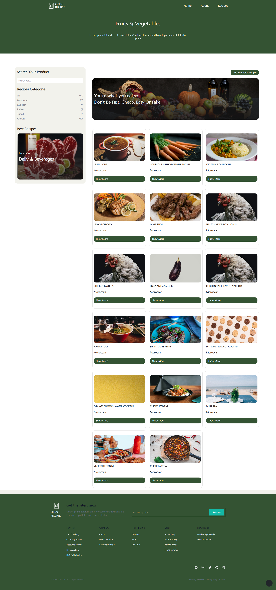
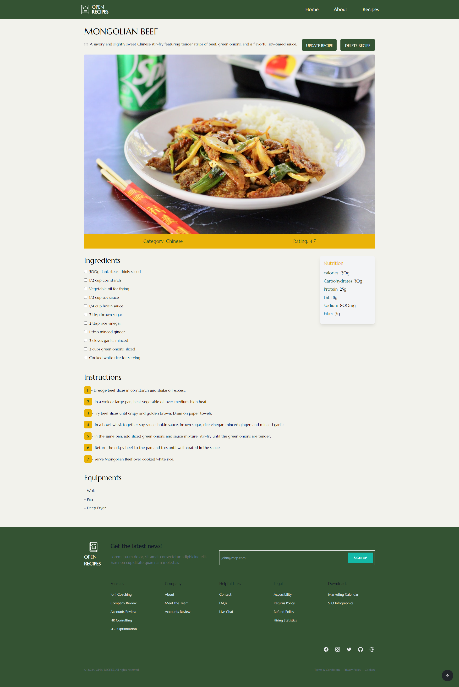
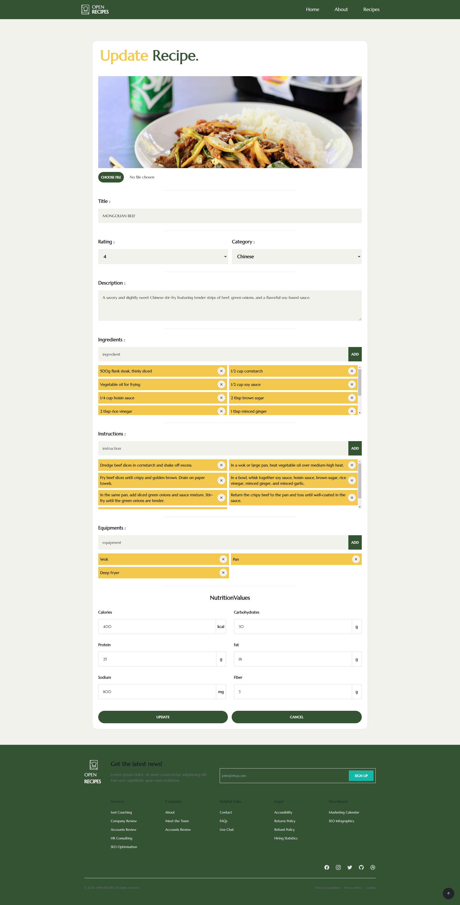

<div align="center">
  <a href="https://github.com/MedtheVorg/Livre-de-Recettes-en-Ligne">
    
  </a>
  <h2 align="center">
    Explore an assortment of recipes and utilize the functionality to add, modify, or delete recipes according to your preferences.
  </h2>
 <br/>
 </div>


<!-- TABLE OF CONTENT -->
<p align="center">
  <a href="#Features">Features</a> •
  <a href="#screen-shots">Screen Shots</a> •
  <a href="#how-to-use">How To Use</a> •
  <a href="#built-with">Built With</a> •
  <a href="#contributors">Contributors</a> •
  <a href="#license">License</a>
  <a href="#credits">Credits</a>
</p>

<!-- ABOUT THE PROJECT -->
## Live Preview

<a href="https://livre-de-recettes-en-ligne.vercel.app/" target="_blank"> https://livre-de-recettes-en-ligne.vercel.app/</a>

## Features

A few of the things you can do with Open Recipes:

* Explore a variety of recipes

* Filter recipes based on categories, making it easy to find specific types of dishes.

* Explore detailed information about a specific recipe on a dedicated page.

* Edit and update the content of any existing recipe.
* Remove recipes that are no longer needed or relevant.

* Easily contribute to the recipe database by adding new recipes.


## Screen Shots
  <details open>
  <summary>Home Page</summary>
    
</details>
<br/>
<details >
  <summary>Recipes page</summary>
    
</details>
<br/>
<details >
  <summary>Single Recipe page</summary>
    
</details>
<br/>
<details >
  <summary>Update Recipe page</summary>
    
</details>

## How to use
To clone and run this application, you'll need [Git](https://git-scm.com) installed on your computer after that simply follow these commands :

```bash
# Clone this repository
$  git clone https://github.com/MedtheVorg/Livre-de-Recettes-en-Ligne.git

# Go into the repository
$ cd livre-de-recettes-en-ligne

# install dependencies
$ npm install

# Run the start script
$ npm start
```


## Built with

<table>
<tr>
<td> </td>
<td align="bottom">

[React ](https://react.dev/learn) - The library for web and native user interfaces
 </td>
</tr>
<tr>

<td> </td>
<td align="bottom">

[Tailwindcss](https://tailwindcss.com) - A utility-first CSS framework packed with classes like flex, pt-4, text-center and rotate-90 that can be composed to build any design, directly in your markup..

 </td>
</tr>

<td> </td>
<td align="bottom">

 [React-Router](https://reactrouter.com/en/main) - React Router is a popular library for handling routing in React applications.

 </td>
</tr>

</tr>
<td> </td>
<td align="bottom">

  [Framer-Motion](https://www.framer.com/motion/) - Framer Motion is a production-ready animation library for React that offers declarative syntax, gestures, drag, and path animations. (for page/modal/section transitions)

 </td>
</tr>

</tr>
<td>Json-Server </td>
<td align="bottom">

[Json-Server](https://github.com/typicode/json-server) - JSON Server is a project that lets you create a fake REST API with a JSON file and some options. You can customize the routes, middlewares, data, and responses of your 
 </td>
</tr>

</tr>
<td> </td>
<td align="bottom">

 [Cloudinary](https://cloudinary.com/) - Cloudinary is a SaaS technology company headquartered in Santa Clara, California, with offices in Israel, England, Poland, and Singapore. The company provides cloud-based image and video management services. It enables users to upload, store, manage, manipulate, and deliver images and video for websites and apps
 
 </td>
</tr>
 </table>

<br/>

## Contributors

<table width="100%"><tr align="left">

  <td align="center"><a href="https://github.com/laitoussyassine"><br/><sub><b>yassine laitouss
 </b></sub></a></td>
  
  <td align="center"><a href="https://github.com/hossam-dev14"><br/><sub><b>hossamdev
 </b></sub></a></td>
  <td align="center"><a href="https://github.com/ibouha"><br/><sub><b>Mohamed Amine IBOUHA
 </b></sub></a></td>
  <td align="center"><a href="https://github.com/MedtheVorg"><br/><sub><b>Mohamed Lem
</b></sub></a></td>


</tr></table>

## License
Distributed under the MIT License. See `LICENSE` for more information.


## Credits
Recipe images : <a href="https://www.unsplash.com/">Unsplash</a>

logo icon : <a href="https://www.flaticon.com/">FLATICONS</a>


